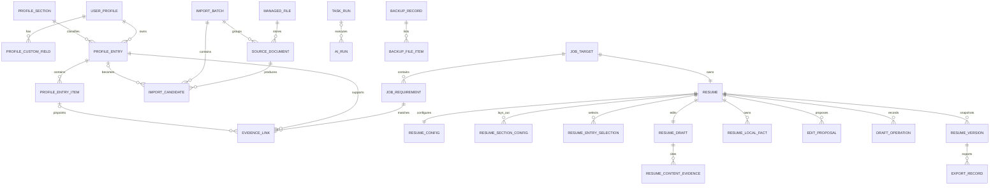

# 影子简历助手本地数据结构设计 V1

> 状态：已确认（2026-08-22；AI 工作流设计阶段补充“当前简历专用事实”）  
> 适用范围：V1 Windows 本地桌面版  
> 上游依据：[PRD.md](./PRD.md)、[TECHNICAL_ARCHITECTURE.md](./TECHNICAL_ARCHITECTURE.md)  
> 目标：确定可直接用于 SQLAlchemy、Alembic、Pydantic 和备份恢复实现的数据结构。

---

## 1. 设计结论

V1 使用一个 SQLite 主数据库保存结构化数据，照片和导入文件保存在本地文件目录，API Key 保存在 Windows Credential Manager。

数据模型遵守以下原则：

- 单机只维护一位求职者资料，但不把单用户假设散落在每张业务表中；
- 所有用户资料字段均为选填，数据库不会强制用户填写不存在的经历、技能、成果或数字；
- 经历采用“通用主记录 + 任意内容项”，支持工作、实习、项目、校园和自定义经历；
- 用户输入、导入结果、AI 生成内容和事实证据保留可追踪来源；
- 每个目标岗位独立保存 JD、匹配、经历取舍、简历配置和草稿；
- 自动保存只更新当前草稿，只有主动“保存版本”或“保存并导出”才创建历史版本；
- 历史版本的正文和配置是不可变快照；
- 业务正文不写日志，API Key 不进入数据库或备份；
- 数据库与附件用稳定 ID 和相对路径关联，不能依赖安装目录或原文件路径。

---

## 2. SQLite 基线

### 2.1 数据库文件

```text
%APPDATA%/ShadowResumeAssistant/data/shadow_resume.db
```

数据库连接初始化必须执行并验证：

```sql
PRAGMA foreign_keys = ON;
PRAGMA journal_mode = WAL;
PRAGMA synchronous = NORMAL;
PRAGMA busy_timeout = 5000;
```

具体约束：

- 每个数据库连接都显式启用外键；
- 使用单个应用进程访问数据库，后端只启一个 Uvicorn worker；
- 不把数据库放在网络盘、同步盘或安装目录；
- 采用短写事务，AI 调用和文件解析期间不得持有数据库事务；
- 使用 WAL 时，备份不得直接复制单独的 `.db` 文件；
- 打包时必须验证 SQLite 运行时版本不低于 `3.51.3`，或使用已包含 WAL-reset 修复的官方回移版本；
- 应用启动记录 SQLite 版本和 PRAGMA 检查结果，但不记录业务数据。

### 2.2 通用字段约定

除纯关联表外，业务表统一包含：

| 字段 | 类型 | 规则 |
|---|---|---|
| `id` | TEXT | UUID，主键，不包含业务含义 |
| `created_at` | TEXT | UTC ISO 8601，必须有值 |
| `updated_at` | TEXT | UTC ISO 8601，必须有值 |
| `revision` | INTEGER | 从 1 开始，用于乐观并发 |

其他约定：

- 布尔值使用 INTEGER `0/1`；
- 枚举使用小写英文字符串，并由应用层和 `CHECK` 双重约束；
- 时间点统一存 UTC，界面按 Asia/Shanghai 或系统时区显示；
- 用户经历中的日期允许不完整，按第 5.4 节保存；
- JSON 字段保存 UTF-8 JSON 文本，并带独立 `schema_version`；
- 金额、评分和 token 数量等数值使用 INTEGER；禁止依赖浮点数保存关键精度值；
- 空字符串在写入前标准化为 `NULL`，用户明确输入的正文空格除外。

---

## 3. 实体关系总览



说明：`USER_PROFILE` 在 V1 中只有一行；`JOB_TARGET` 可以有多行；每个岗位在 V1 只有一个当前简历工作台 `RESUME`，但可以有多个 `RESUME_VERSION`。

---

## 4. 表清单

| 分组 | 表 |
|---|---|
| 资料库 | `user_profile`、`profile_custom_field`、`profile_section`、`profile_entry`、`profile_entry_item` |
| 文件导入 | `managed_file`、`import_batch`、`source_document`、`import_candidate` |
| 岗位匹配 | `job_target`、`job_requirement`、`evidence_link` |
| 简历工作台 | `resume`、`resume_config`、`resume_section_config`、`resume_entry_selection`、`resume_local_fact`、`resume_draft`、`resume_content_evidence` |
| AI 修改 | `edit_proposal`、`edit_proposal_evidence`、`draft_operation` |
| 版本导出 | `resume_version`、`export_record` |
| 任务与 AI | `task_run`、`ai_run` |
| 设置和运维 | `app_setting`、`backup_record`、`backup_file_item`、`pending_file_operation`、`alembic_version` |

V1 不建立聊天消息表，因为产品不是聊天型简历 Agent；语音只是把一次修改指令转成文字。

---

## 5. 个人资料库

### 5.1 `user_profile`

V1 固定一行，首次启动创建。

| 字段 | 类型 | 可空 | 说明 |
|---|---|---:|---|
| `id` | TEXT PK | 否 | 固定用户资料 ID |
| `display_name` | TEXT | 是 | 姓名 |
| `phone` | TEXT | 是 | 手机号，受保护字段 |
| `email` | TEXT | 是 | 邮箱，受保护字段 |
| `city` | TEXT | 是 | 所在城市 |
| `github_url` | TEXT | 是 | GitHub |
| `website_url` | TEXT | 是 | 个人网站 |
| `portfolio_url` | TEXT | 是 | 在线作品集链接 |
| `photo_file_id` | TEXT FK | 是 | 指向 `managed_file` |
| `summary_source_text` | TEXT | 是 | 用户资料库中的原始自我介绍素材 |
| `privacy_notice_accepted_at` | TEXT | 是 | 隐私说明确认时间 |
| 通用字段 |  |  | `created_at`、`updated_at`、`revision` |

姓名、电话、邮箱和照片在调用文本模型前必须由隐私层移除或替换为本地占位符。

### 5.2 `profile_custom_field`

保存用户自定义基本信息，例如“博客”“微信（仅投递特定岗位时使用）”。

| 字段 | 类型 | 可空 | 说明 |
|---|---|---:|---|
| `id` | TEXT PK | 否 |  |
| `profile_id` | TEXT FK | 否 | `user_profile.id` |
| `label` | TEXT | 否 | 显示名称；用户创建时必须填写 |
| `value` | TEXT | 是 | 值可暂时为空 |
| `data_kind` | TEXT | 否 | `text`、`url`、`phone`、`email`、`other` |
| `is_sensitive` | INTEGER | 否 | 默认 1；发送 AI 前过滤 |
| `sort_order` | INTEGER | 否 | 从 0 开始 |
| 通用字段 |  |  |  |

唯一索引：`(profile_id, sort_order)` 不要求唯一，以便拖动过程中使用事务重新排序。

### 5.3 `profile_section`

定义内置栏目和用户自定义栏目。

| 字段 | 类型 | 可空 | 说明 |
|---|---|---:|---|
| `id` | TEXT PK | 否 |  |
| `section_key` | TEXT | 否 | 稳定键，如 `education`、`work`、`project` |
| `display_name` | TEXT | 否 | 中文栏目名 |
| `is_builtin` | INTEGER | 否 | 内置栏目为 1 |
| `default_resume_selected` | INTEGER | 否 | 仅用于新简历初始值 |
| `default_sort_order` | INTEGER | 否 | 默认顺序 |
| `is_archived` | INTEGER | 否 | 自定义栏目可归档；内置栏目不可删除 |
| 通用字段 |  |  |  |

内置种子：`education`、`work`、`internship`、`project`、`campus`、`skill`、`certificate`、`other`。个人信息和自我介绍是简历展示栏目，不作为经历条目类型强塞进本表。

约束：`section_key` 唯一；自定义键使用 `custom:<uuid>`，避免用户改名后关联失效。

### 5.4 经历日期表示

用户可能只知道年份、年月、完整日期，或直接输入“至今”“大三期间”。因此 `profile_entry` 同时保存：

- `start_date_text` / `end_date_text`：用户原始显示文字；
- `start_year` / `end_year`：可空整数；
- `start_month` / `end_month`：可空 1–12；
- `start_day` / `end_day`：可空 1–31；
- `date_precision`：`none`、`year`、`month`、`day`、`free_text`；
- `is_current`：是否“至今”。

程序不得把只填写“2023”的日期自动补成 2023-01-01，也不得把自由文本猜成精确日期。排序使用已知年月构造的辅助值，显示始终优先使用用户原文。

### 5.5 `profile_entry`

工作、实习、教育、项目、校园、技能、证书和其他经历共用主表。

| 字段 | 类型 | 可空 | 说明 |
|---|---|---:|---|
| `id` | TEXT PK | 否 |  |
| `profile_id` | TEXT FK | 否 | V1 指向唯一用户 |
| `section_id` | TEXT FK | 否 | 所属栏目 |
| `title` | TEXT | 是 | 项目名、学校、职位、证书名等 |
| `organization` | TEXT | 是 | 公司、学校、社团、颁发组织等 |
| `role` | TEXT | 是 | 职位或个人角色 |
| `location` | TEXT | 是 | 地点 |
| `start_date_text` | TEXT | 是 | 原始开始时间 |
| `end_date_text` | TEXT | 是 | 原始结束时间 |
| `start_year/month/day` | INTEGER | 是 | 可解析部分 |
| `end_year/month/day` | INTEGER | 是 | 可解析部分 |
| `date_precision` | TEXT | 否 | 见 5.4 |
| `is_current` | INTEGER | 否 | 默认 0 |
| `raw_text` | TEXT | 是 | 用户自由输入或确认后的原始描述 |
| `content_state` | TEXT | 否 | `empty`、`usable` |
| `source_kind` | TEXT | 否 | `manual`、`imported`、`ai_suggested_confirmed` |
| `source_document_id` | TEXT FK | 是 | 来源文档 |
| `source_candidate_id` | TEXT FK | 是 | 来源导入候选 |
| `sort_order` | INTEGER | 否 | 栏目内顺序 |
| 通用字段 |  |  |  |

重要规则：

- 除系统字段外，所有内容字段可空；
- 新增后允许先保存 `content_state=empty`，满足自动保存；
- 标题、组织、角色、时间、自由文本或任一 `profile_entry_item` 有实际内容时变为 `usable`；
- `empty` 记录不阻止资料保存，但不进入岗位匹配和简历生成；
- 数据库不要求技能、成果、职责或量化数据存在；
- 复制经历会创建新 ID 和新内容项，不继承导入候选 ID。

索引：`(profile_id, section_id, sort_order)`、`source_document_id`、`updated_at`。

### 5.6 `profile_entry_item`

保存一段经历中任意数量、任意组合的内容。

| 字段 | 类型 | 可空 | 说明 |
|---|---|---:|---|
| `id` | TEXT PK | 否 | 稳定事实项 ID，可被简历证据引用 |
| `entry_id` | TEXT FK | 否 | `profile_entry.id` |
| `item_kind` | TEXT | 否 | 见下方枚举 |
| `label` | TEXT | 是 | 自定义标签，如“我的贡献” |
| `content` | TEXT | 是 | 可在编辑中暂时为空 |
| `value_number` | TEXT | 是 | 用户明确提供的数字原文，不做浮点推断 |
| `unit` | TEXT | 是 | `%`、人、次等 |
| `is_quantified` | INTEGER | 否 | 用户是否明确提供量化信息 |
| `source_kind` | TEXT | 否 | `manual`、`imported`、`ai_suggested_confirmed` |
| `sort_order` | INTEGER | 否 | 条目内顺序 |
| 通用字段 |  |  |  |

`item_kind` 内置值：

- `background_goal`：背景或目标；
- `responsibility`：职责或行动；
- `skill`：技能或工具；
- `challenge_solution`：难点与解决方法；
- `outcome`：成果；
- `metric`：用户明确提供的量化事实；
- `note`：补充说明；
- `custom`：用户自定义内容。

这只是帮助整理，不是必填清单。用户可以一项都不填，也可以只填任意一项。`content` 为空的项不进入 AI 上下文。

删除 `profile_entry` 时级联删除其内容项；若内容已被历史版本引用，历史版本仍保留当时的文本快照，不依赖资料库记录继续存在。

---

## 6. 文件与导入

### 6.1 `managed_file`

统一登记应用数据目录内的文件。

| 字段 | 类型 | 可空 | 说明 |
|---|---|---:|---|
| `id` | TEXT PK | 否 |  |
| `file_kind` | TEXT | 否 | `photo`、`source_document`、`extracted_text`、`temp_audio`、`temp_export` |
| `relative_path` | TEXT | 否 | 相对应用数据根目录 |
| `original_name` | TEXT | 是 | 安全处理后的显示名 |
| `extension` | TEXT | 是 | 小写扩展名 |
| `mime_type` | TEXT | 是 | 检测结果，不完全信任上传声明 |
| `size_bytes` | INTEGER | 否 | 非负 |
| `sha256` | TEXT | 否 | 文件校验和 |
| `state` | TEXT | 否 | `staged`、`active`、`pending_delete`、`missing` |
| `retention_kind` | TEXT | 否 | `persistent`、`temporary` |
| `expires_at` | TEXT | 是 | 临时文件清理时间 |
| 通用字段 |  |  |  |

`relative_path` 唯一。路径必须规范化并验证仍在应用数据目录内。临时录音转写成功、取消或过期后进入删除队列。

### 6.2 `import_batch`

一次用户导入操作。

| 字段 | 类型 | 可空 | 说明 |
|---|---|---:|---|
| `id` | TEXT PK | 否 |  |
| `purpose` | TEXT | 否 | `resume`、`portfolio` |
| `status` | TEXT | 否 | `uploaded`、`extracting`、`classifying`、`awaiting_review`、`confirmed`、`failed`、`cancelled` |
| `task_id` | TEXT FK | 是 | 长任务 |
| `candidate_count` | INTEGER | 否 | 默认 0 |
| `confirmed_count` | INTEGER | 否 | 默认 0 |
| `ignored_count` | INTEGER | 否 | 默认 0 |
| `error_code` | TEXT | 是 | 失败码 |
| `confirmed_at` | TEXT | 是 |  |
| 通用字段 |  |  |  |

### 6.3 `source_document`

| 字段 | 类型 | 可空 | 说明 |
|---|---|---:|---|
| `id` | TEXT PK | 否 |  |
| `batch_id` | TEXT FK | 否 | `import_batch.id` |
| `file_id` | TEXT FK | 否 | 原文件 |
| `document_kind` | TEXT | 否 | `resume`、`portfolio` |
| `parse_status` | TEXT | 否 | `pending`、`parsed`、`unsupported_scan`、`failed` |
| `extracted_text_file_id` | TEXT FK | 是 | 提取文本文件；避免大文本塞入主表 |
| `page_count` | INTEGER | 是 | PDF 页数或 DOCX 估算页数 |
| `parser_name` | TEXT | 是 | 解析器标识 |
| `parser_version` | TEXT | 是 | 便于回归 |
| `text_sha256` | TEXT | 是 | 提取文本哈希 |
| `error_code` | TEXT | 是 |  |
| 通用字段 |  |  |  |

`file_id` 唯一，防止同一登记文件被两个文档重复消费。扫描 PDF 不产生候选项。

### 6.4 `import_candidate`

AI 或规则从文档中提取、等待用户确认的候选资料。

| 字段 | 类型 | 可空 | 说明 |
|---|---|---:|---|
| `id` | TEXT PK | 否 |  |
| `batch_id` | TEXT FK | 否 |  |
| `source_document_id` | TEXT FK | 否 |  |
| `candidate_kind` | TEXT | 否 | `profile_field`、`profile_entry`、`entry_item` |
| `suggested_section_key` | TEXT | 是 | 建议分类 |
| `payload_json` | TEXT | 否 | 候选字段；Schema 版本化 |
| `source_locator_json` | TEXT | 是 | 页码、段落、字符范围 |
| `confidence` | TEXT | 是 | `high`、`medium`、`low`，不用虚假百分比 |
| `decision` | TEXT | 否 | `pending`、`accepted`、`reclassified`、`merged`、`ignored` |
| `target_entry_id` | TEXT FK | 是 | 接受或合并后的资料记录 |
| `decided_at` | TEXT | 是 |  |
| 通用字段 |  |  |  |

只有用户确认后才创建或修改正式资料。`payload_json` 保留导入候选快照，正式资料之后的编辑不反向改写候选。

---

## 7. 目标岗位与匹配

### 7.1 `job_target`

| 字段 | 类型 | 可空 | 说明 |
|---|---|---:|---|
| `id` | TEXT PK | 否 |  |
| `company_name` | TEXT | 是 | 可由 AI 提取或手填 |
| `job_title` | TEXT | 是 | 可由 AI 提取或手填 |
| `jd_text` | TEXT | 是 | 原始 JD |
| `user_notes` | TEXT | 是 | 用户备注 |
| `status` | TEXT | 否 | 见下方 |
| `analysis_status` | TEXT | 否 | `not_started`、`running`、`ready`、`stale`、`failed` |
| `analysis_source_revision` | INTEGER | 是 | 分析时的岗位 revision |
| `last_analyzed_at` | TEXT | 是 |  |
| 通用字段 |  |  |  |

`status`：`not_analyzed`、`needs_profile`、`not_generated`、`editing`、`unsaved_changes`、`version_saved`。

JD 或公司/岗位信息修改后，已有分析标记为 `stale`，但不立刻删除，用户可以查看旧结果并重新分析。岗位名称和公司名称在建立空白岗位草稿时可空；执行正式分析前至少要求存在可分析的 JD，并在提取失败时提示用户补充名称。

索引：`updated_at DESC`、`status`。

### 7.2 `job_requirement`

| 字段 | 类型 | 可空 | 说明 |
|---|---|---:|---|
| `id` | TEXT PK | 否 |  |
| `job_id` | TEXT FK | 否 |  |
| `requirement_type` | TEXT | 否 | `responsibility`、`required_skill`、`preferred_skill`、`experience`、`education`、`other` |
| `source_text` | TEXT | 否 | JD 原文片段 |
| `summary` | TEXT | 否 | 结构化摘要 |
| `importance` | TEXT | 否 | `must`、`preferred`、`context` |
| `sort_order` | INTEGER | 否 |  |
| `analysis_run_id` | TEXT FK | 是 | 来源 AI run |
| `source_locator_json` | TEXT | 是 | JD 字符范围 |
| `is_active` | INTEGER | 否 | 重分析后旧要求置 0，便于审计 |
| 通用字段 |  |  |  |

索引：`(job_id, is_active, sort_order)`。

### 7.3 `evidence_link`

连接岗位要求和真实资料。

| 字段 | 类型 | 可空 | 说明 |
|---|---|---:|---|
| `id` | TEXT PK | 否 |  |
| `requirement_id` | TEXT FK | 否 |  |
| `profile_entry_id` | TEXT FK | 否 | 证据所属经历 |
| `profile_entry_item_id` | TEXT FK | 是 | 精确到某一职责/技能/成果 |
| `match_level` | TEXT | 否 | `strong`、`partial`、`missing`、`irrelevant` |
| `evidence_explanation` | TEXT | 是 | 为什么匹配 |
| `missing_information` | TEXT | 是 | 缺什么；只作建议 |
| `recommendation` | TEXT | 否 | `include`、`optional`、`do_not_emphasize` |
| `user_override` | TEXT | 否 | `none`、`do_not_emphasize` |
| `analysis_run_id` | TEXT FK | 是 |  |
| `is_active` | INTEGER | 否 |  |
| 通用字段 |  |  |  |

若 `match_level=missing` 且找不到具体经历，可以不创建本表记录，而直接在 `job_requirement` 的分析展示 DTO 中返回缺失状态。表内记录必须指向真实存在的资料；不能创建“虚构证据”占位行。

唯一索引：当前分析中 `(requirement_id, profile_entry_id, profile_entry_item_id, is_active)`。

---

## 8. 简历配置与当前草稿

### 8.1 `resume`

每个岗位一个工作台根实体。

| 字段 | 类型 | 可空 | 说明 |
|---|---|---:|---|
| `id` | TEXT PK | 否 |  |
| `job_id` | TEXT FK | 否 | 唯一 |
| `title` | TEXT | 是 | 工作台显示名称 |
| `state` | TEXT | 否 | `configuring`、`generating`、`editing`、`blocked_by_risk`、`ready` |
| `last_saved_version_id` | TEXT FK | 是 | 最近主动保存版本 |
| 通用字段 |  |  |  |

删除岗位时级联删除其工作台、草稿、版本、匹配和任务业务记录；实际文件通过文件清理队列删除。

### 8.2 `resume_config`

| 字段 | 类型 | 可空 | 说明 |
|---|---|---:|---|
| `id` | TEXT PK | 否 |  |
| `resume_id` | TEXT FK | 否 | 唯一 |
| `template_key` | TEXT | 否 | `simple_single`、`technical_double` |
| `page_limit` | INTEGER | 否 | 1 或 2 |
| `primary_strategy` | TEXT | 否 | 写作策略键 |
| `strategy_options_json` | TEXT | 否 | ATS、量化等开关及版本 |
| `template_version` | TEXT | 否 | 模板版本 |
| `rule_pack_version` | TEXT | 否 | 写作规则包版本 |
| 通用字段 |  |  |  |

新建时默认单栏、一页、简洁表达；最终默认值可在模板设计阶段调整。

### 8.3 `resume_section_config`

保存栏目勾选、顺序、左右栏和栏目级策略。

| 字段 | 类型 | 可空 | 说明 |
|---|---|---:|---|
| `id` | TEXT PK | 否 |  |
| `resume_id` | TEXT FK | 否 |  |
| `section_key` | TEXT | 否 | 内置显示栏目或自定义栏目稳定键 |
| `display_name` | TEXT | 否 | 本次简历显示名 |
| `is_enabled` | INTEGER | 否 | 是否勾选 |
| `column_key` | TEXT | 否 | `main`、`left`、`right` |
| `sort_order` | INTEGER | 否 | 当前栏顺序 |
| `strategy_key` | TEXT | 是 | 栏目级写作策略；空则继承全局 |
| 通用字段 |  |  |  |

唯一约束：`(resume_id, section_key)`。默认勾选 `personal_info`、`work`、`skills`、`summary`；空栏目在生成前提示补充或取消，不自动编写。

### 8.4 `resume_entry_selection`

保存“只影响这一份简历”的经历取舍。

| 字段 | 类型 | 可空 | 说明 |
|---|---|---:|---|
| `id` | TEXT PK | 否 |  |
| `resume_id` | TEXT FK | 否 |  |
| `profile_entry_id` | TEXT FK | 否 | 本次取舍的资料库经历 |
| `selection_mode` | TEXT | 否 | `must_include`、`exclude_this_resume`、`ai_decide` |
| `user_note` | TEXT | 是 | 本次取舍原因 |
| 通用字段 |  |  |  |

唯一约束：`(resume_id, profile_entry_id)`。资料库删除某经历前必须提示它被多少当前简历配置引用；确认后级联删除选择记录，但历史版本不受影响。

### 8.5 `resume_local_fact`

保存用户明确确认、但选择“只用于当前简历”的真实补充信息。

| 字段 | 类型 | 可空 | 说明 |
|---|---|---:|---|
| `id` | TEXT PK | 否 | 稳定证据 ID |
| `resume_id` | TEXT FK | 否 | 只属于当前简历 |
| `fact_kind` | TEXT | 否 | `responsibility`、`skill`、`outcome`、`metric`、`context`、`other` |
| `content` | TEXT | 否 | 用户确认后的事实原文 |
| `source_instruction_text` | TEXT | 是 | 最初补充该事实的修改指令 |
| `confirmed_by_user_at` | TEXT | 否 | 必须经过用户确认 |
| `state` | TEXT | 否 | `active`、`archived`、`promoted_to_profile` |
| `promoted_profile_entry_id` | TEXT FK | 是 | 后续保存到资料库时关联 |
| `promoted_profile_entry_item_id` | TEXT FK | 是 | 可精确到内容项 |
| 通用字段 |  |  |  |

AI 不得自行创建本表记录。只有系统检测到修改指令包含资料库中没有的新事实，并让用户确认“事实正确”及选择“只用于当前简历”后才能写入。选择“同时保存到个人资料库”时创建正式资料项，并把本记录标记为 `promoted_to_profile`。

### 8.6 `ResumeDocument` 中间模型

当前草稿和历史版本共用一个版本化 JSON Schema。最小结构：

```json
{
  "schema_version": 1,
  "document_id": "uuid",
  "language": "zh-CN",
  "personal_info": {
    "name_token": "{{NAME}}",
    "contact_tokens": ["{{PHONE}}", "{{EMAIL}}"]
  },
  "sections": [
    {
      "node_id": "uuid",
      "section_key": "project",
      "title": "项目经历",
      "column": "main",
      "order": 2,
      "blocks": [
        {
          "node_id": "uuid",
          "block_type": "experience",
          "heading": "影子简历助手",
          "meta": "个人项目｜2026",
          "paragraphs": [
            {"node_id": "uuid", "text": "……"}
          ]
        }
      ]
    }
  ]
}
```

要求：

- 每个可编辑段落拥有稳定 `node_id`；
- 内容 JSON 不保存真实姓名、手机号和邮箱，使用占位符；预览和导出时本地填回；
- JSON 中不保存 UI 临时选区、面板开关或 API 响应原文；
- Word、PDF 和中间预览都读取同一份模型；
- Schema 升级必须有纯函数迁移和回归样本。

### 8.7 `resume_draft`

| 字段 | 类型 | 可空 | 说明 |
|---|---|---:|---|
| `id` | TEXT PK | 否 |  |
| `resume_id` | TEXT FK | 否 | 唯一 |
| `document_schema_version` | INTEGER | 否 | 当前为 1 |
| `document_json` | TEXT | 否 | 当前完整草稿 |
| `content_revision` | INTEGER | 否 | 每次正文变化递增 |
| `base_version_id` | TEXT FK | 是 | 草稿由哪个历史版本恢复而来 |
| `generation_run_id` | TEXT FK | 是 | 最近整份生成来源 |
| `fact_check_status` | TEXT | 否 | `not_checked`、`checking`、`passed`、`warning`、`blocked` |
| `layout_check_status` | TEXT | 否 | `not_checked`、`checking`、`passed`、`overflow`、`failed` |
| `has_unaccepted_ai_content` | INTEGER | 否 | 默认 0 |
| `has_unsaved_version_changes` | INTEGER | 否 | 与最近版本是否不同 |
| `content_hash` | TEXT | 否 | 规范化 JSON SHA-256 |
| `last_autosaved_at` | TEXT | 是 |  |
| 通用字段 |  |  |  |

自动保存使用 `revision` 做乐观并发。保存历史版本后，若当前草稿哈希等于新版本哈希，则 `has_unsaved_version_changes=0`。

### 8.8 `resume_content_evidence`

保存草稿某个节点使用的真实证据。

| 字段 | 类型 | 可空 | 说明 |
|---|---|---:|---|
| `id` | TEXT PK | 否 |  |
| `draft_id` | TEXT FK | 否 |  |
| `content_node_id` | TEXT | 否 | `ResumeDocument` 中的 node_id |
| `profile_entry_id` | TEXT FK | 是 | 资料库证据 |
| `profile_entry_item_id` | TEXT FK | 是 |  |
| `resume_local_fact_id` | TEXT FK | 是 | 当前简历专用事实 |
| `evidence_role` | TEXT | 否 | `direct`、`context` |
| `evidence_snapshot_text` | TEXT | 否 | 生成当时证据文本，用于资料修改后的风险复查 |
| `source_revision` | INTEGER | 否 | 资料当时 revision |
| `created_at` | TEXT | 否 |  |

每条引用必须且只能选择一种来源：资料库证据或 `resume_local_fact`。资料库来源有 `profile_entry_id`，当前简历来源有 `resume_local_fact_id`。重复引用由应用层和条件唯一索引共同阻止。

资料修改后，如果来源 revision 变化，草稿对应节点标记为待复查；历史版本的证据快照不变。

---

## 9. AI 段落修改与撤销

### 9.1 `edit_proposal`

| 字段 | 类型 | 可空 | 说明 |
|---|---|---:|---|
| `id` | TEXT PK | 否 |  |
| `resume_id` | TEXT FK | 否 |  |
| `draft_revision_at_request` | INTEGER | 否 | 请求时草稿 revision |
| `target_node_ids_json` | TEXT | 否 | 只允许目标节点 |
| `instruction_text` | TEXT | 否 | 用户确认后的文字/语音转写 |
| `instruction_source` | TEXT | 否 | `typed`、`voice_transcript` |
| `before_json` | TEXT | 否 | 修改前目标内容 |
| `after_json` | TEXT | 是 | 建议内容 |
| `reason_text` | TEXT | 是 | 修改理由 |
| `status` | TEXT | 否 | `generating`、`ready`、`accepted`、`rejected`、`stale`、`failed` |
| `contains_new_fact` | INTEGER | 否 | 事实检查结果 |
| `risk_json` | TEXT | 是 | 风险明细 |
| `ai_run_id` | TEXT FK | 是 |  |
| `accepted_at` | TEXT | 是 |  |
| `rejected_at` | TEXT | 是 |  |
| 通用字段 |  |  |  |

接受建议时必须在一个事务中：检查草稿 revision、更新指定节点、写入撤销操作、刷新证据引用、更新草稿哈希和建议状态。若目标内容已变化，建议变为 `stale`，不能覆盖新内容。

### 9.2 `edit_proposal_evidence`

| 字段 | 类型 | 可空 | 说明 |
|---|---|---:|---|
| `id` | TEXT PK | 否 |  |
| `proposal_id` | TEXT FK | 否 |  |
| `profile_entry_id` | TEXT FK | 是 | 资料库证据 |
| `profile_entry_item_id` | TEXT FK | 是 | 可精确到内容项；使用当前简历事实时可空 |
| `resume_local_fact_id` | TEXT FK | 是 | 当前简历专用事实；使用它时 `profile_entry_id` 可空 |
| `evidence_snapshot_text` | TEXT | 否 |  |

`profile_entry_id` 在资料库证据模式下必填，在当前简历事实模式下可空；每行必须且只能选择一种来源。同一建议引用同一事实项时由应用层去重；单独主键可避免 SQLite 组合唯一约束中可空字段产生歧义。

### 9.3 `draft_operation`

支持撤销/重做，但不是历史版本。

| 字段 | 类型 | 可空 | 说明 |
|---|---|---:|---|
| `id` | TEXT PK | 否 |  |
| `resume_id` | TEXT FK | 否 |  |
| `sequence_no` | INTEGER | 否 | 每份草稿递增 |
| `operation_kind` | TEXT | 否 | `manual_edit`、`accept_ai`、`layout_change`、`restore_version` |
| `forward_patch_json` | TEXT | 否 | JSON Patch |
| `reverse_patch_json` | TEXT | 否 | 撤销 Patch |
| `base_content_hash` | TEXT | 否 | 执行前哈希 |
| `result_content_hash` | TEXT | 否 | 执行后哈希 |
| `state` | TEXT | 否 | `applied`、`undone` |
| `proposal_id` | TEXT FK | 是 | AI 修改时关联 |
| `created_at` | TEXT | 否 |  |

每份草稿最多保留最近 100 个操作；创建正式版本不清空撤销栈，恢复历史版本会建立一个可撤销的整体操作。用户在撤销后产生新编辑时，清除当前位置之后的 redo 分支。

---

## 10. 历史版本与导出

### 10.1 `resume_version`

| 字段 | 类型 | 可空 | 说明 |
|---|---|---:|---|
| `id` | TEXT PK | 否 |  |
| `resume_id` | TEXT FK | 否 |  |
| `version_number` | INTEGER | 否 | 每份简历从 1 递增 |
| `display_name` | TEXT | 是 | 可修改的版本名 |
| `user_note` | TEXT | 是 | 可修改的备注 |
| `saved_reason` | TEXT | 否 | `manual_save`、`save_and_export`、`pre_restore_save` |
| `document_schema_version` | INTEGER | 否 |  |
| `document_json` | TEXT | 否 | 不可变正文快照 |
| `config_snapshot_json` | TEXT | 否 | 模板、页数、栏目、顺序、策略、经历取舍 |
| `job_snapshot_json` | TEXT | 否 | 公司、岗位和 JD 哈希/必要展示信息 |
| `evidence_snapshot_json` | TEXT | 否 | 使用的资料和事实快照 |
| `fact_check_snapshot_json` | TEXT | 否 | 检查状态与风险 |
| `content_hash` | TEXT | 否 | 规范化正文哈希 |
| `template_key` | TEXT | 否 | 便于列表筛选 |
| `template_version` | TEXT | 否 |  |
| `page_limit` | INTEGER | 否 | 1 或 2 |
| `saved_at` | TEXT | 否 | 主排序时间 |
| `created_at` | TEXT | 否 |  |

唯一约束：`(resume_id, version_number)`。只允许更新 `display_name` 和 `user_note`；其余快照字段在 Repository 层禁止 UPDATE。删除版本为用户明确操作，不影响当前草稿，除非该版本是 `base_version_id`，此时只清空关联 ID，不改变草稿正文。

### 10.2 `export_record`

| 字段 | 类型 | 可空 | 说明 |
|---|---|---:|---|
| `id` | TEXT PK | 否 |  |
| `resume_id` | TEXT FK | 否 |  |
| `version_id` | TEXT FK | 是 | 保存并导出时关联正式版本 |
| `format` | TEXT | 否 | `docx`、`pdf` |
| `status` | TEXT | 否 | `preparing`、`succeeded`、`failed` |
| `output_path` | TEXT | 是 | 用户选择的绝对路径；仅作记录，不纳入备份文件 |
| `file_name` | TEXT | 是 |  |
| `size_bytes` | INTEGER | 是 |  |
| `sha256` | TEXT | 是 | 成功后写入 |
| `page_count` | INTEGER | 是 | PDF 必填，DOCX 可空 |
| `template_key` | TEXT | 否 |  |
| `template_version` | TEXT | 否 |  |
| `error_code` | TEXT | 是 |  |
| `exported_at` | TEXT | 是 |  |
| 通用字段 |  |  |  |

外部导出文件不属于应用托管文件，清除应用数据时只删除导出记录，不删除用户已导出到桌面或其他目录的 Word/PDF。

---

## 11. 长任务与 AI 调用

### 11.1 `task_run`

| 字段 | 类型 | 可空 | 说明 |
|---|---|---:|---|
| `id` | TEXT PK | 否 |  |
| `task_type` | TEXT | 否 | `import`、`job_analysis`、`matching`、`resume_generate`、`edit_proposal`、`transcription`、`docx_export`、`backup`、`restore` |
| `status` | TEXT | 否 | `queued`、`running`、`succeeded`、`failed`、`cancelled`、`interrupted` |
| `progress_step` | TEXT | 是 | 稳定步骤键 |
| `progress_percent` | INTEGER | 是 | 只有可准确计算时填写 |
| `message_key` | TEXT | 是 | 前端中文文案键 |
| `owner_type` | TEXT | 是 | `job`、`resume`、`import_batch`、`backup` |
| `owner_id` | TEXT | 是 | 逻辑关联，按 owner_type 校验 |
| `retry_of_task_id` | TEXT FK | 是 |  |
| `cancel_requested_at` | TEXT | 是 |  |
| `started_at` | TEXT | 是 |  |
| `finished_at` | TEXT | 是 |  |
| `error_code` | TEXT | 是 |  |
| `error_details_json` | TEXT | 是 | 已脱敏的结构化信息 |
| 通用字段 |  |  |  |

启动时将遗留 `running` 改成 `interrupted`。任务表只保存进度和错误元数据，不保存录音或完整 AI 请求正文。

### 11.2 `ai_run`

用于调试、成本统计和评测追踪，不作为聊天历史。

| 字段 | 类型 | 可空 | 说明 |
|---|---|---:|---|
| `id` | TEXT PK | 否 |  |
| `task_id` | TEXT FK | 是 |  |
| `workflow_type` | TEXT | 否 | `profile_classify`、`job_parse`、`evidence_match`、`resume_generate`、`paragraph_rewrite`、`fact_check`、`transcribe` |
| `provider` | TEXT | 否 | V1 为 `openai` |
| `model` | TEXT | 否 | 实际模型名 |
| `prompt_key` | TEXT | 是 | 转写可空 |
| `prompt_version` | TEXT | 是 |  |
| `input_schema_version` | INTEGER | 是 |  |
| `output_schema_version` | INTEGER | 是 |  |
| `input_fingerprint` | TEXT | 是 | 脱敏规范化输入哈希 |
| `status` | TEXT | 否 | `running`、`succeeded`、`failed`、`cancelled` |
| `attempt_no` | INTEGER | 否 | 从 1 开始 |
| `input_tokens` | INTEGER | 是 | 供应商返回时记录 |
| `output_tokens` | INTEGER | 是 |  |
| `latency_ms` | INTEGER | 是 |  |
| `provider_request_id` | TEXT | 是 | 不含密钥 |
| `finish_reason` | TEXT | 是 |  |
| `error_code` | TEXT | 是 |  |
| `started_at` | TEXT | 否 |  |
| `finished_at` | TEXT | 是 |  |

默认不持久化完整 prompt、完整模型响应或音频；业务需要保留的结构化结果进入对应业务表。设置中如未来加入“诊断模式”，也必须经过显式同意和自动过期，V1 不实现。

---

## 12. 设置、文件事务与凭据

### 12.1 `app_setting`

只保存非敏感设置。

| 字段 | 类型 | 可空 | 说明 |
|---|---|---:|---|
| `key` | TEXT PK | 否 | 白名单键 |
| `value_json` | TEXT | 否 | 版本化 JSON |
| `updated_at` | TEXT | 否 |  |

V1 白名单示例：

- `onboarding.completed`；
- `ai.provider`；
- `ai.text_model`；
- `ai.transcription_model`；
- `ai.timeout_seconds`；
- `privacy.notice_version`；
- `ui.theme`；
- `ui.window_state`；
- `backup.last_directory`；
- `export.last_directory`。

禁止键：API Key、Bearer token、完整简历、JD、录音、身份证号。模型 Key 使用 Windows Credential Manager，服务名固定为 `ShadowResumeAssistant/<provider>`。

### 12.2 `pending_file_operation`

协调数据库事务和文件系统操作。

| 字段 | 类型 | 可空 | 说明 |
|---|---|---:|---|
| `id` | TEXT PK | 否 |  |
| `operation_type` | TEXT | 否 | `activate`、`delete`、`move` |
| `file_id` | TEXT FK | 是 |  |
| `source_rel_path` | TEXT | 是 |  |
| `target_rel_path` | TEXT | 是 |  |
| `status` | TEXT | 否 | `pending`、`done`、`failed` |
| `attempt_count` | INTEGER | 否 |  |
| `last_error_code` | TEXT | 是 |  |
| `created_at` | TEXT | 否 |  |
| `completed_at` | TEXT | 是 |  |

新增文件先写暂存区并校验哈希，再在数据库事务中登记文件和待激活操作，最后原子移动。删除先在数据库中标记 `pending_delete`，提交后执行物理删除；失败可在下次启动重试。

---

## 13. 备份结构

### 13.1 备份文件格式

建议扩展名：`.shadowresume-backup`，内部是未加密 ZIP：

```text
manifest.json
database/shadow_resume.db
files/profile/...
files/imports/originals/...
```

不包含：

- OpenAI API Key；
- session token；
- 日志；
- 临时录音和临时导出；
- 用户导出到应用目录之外的 Word/PDF 实体文件。

### 13.2 `backup_record`

保存本机执行历史；恢复到另一台电脑后可随数据库一起恢复。

| 字段 | 类型 | 可空 | 说明 |
|---|---|---:|---|
| `id` | TEXT PK | 否 |  |
| `backup_kind` | TEXT | 否 | `manual`、`pre_restore_auto` |
| `status` | TEXT | 否 | `preparing`、`succeeded`、`failed` |
| `backup_format_version` | INTEGER | 否 | V1 为 1 |
| `database_schema_revision` | TEXT | 否 | Alembic revision |
| `app_version` | TEXT | 否 |  |
| `output_path` | TEXT | 是 | 仅本机历史；manifest 不依赖此路径 |
| `archive_sha256` | TEXT | 是 | 成功后写入 |
| `archive_size_bytes` | INTEGER | 是 |  |
| `item_count` | INTEGER | 是 |  |
| `error_code` | TEXT | 是 |  |
| `completed_at` | TEXT | 是 |  |
| 通用字段 |  |  |  |

### 13.3 `backup_file_item`

| 字段 | 类型 | 可空 | 说明 |
|---|---|---:|---|
| `backup_id` | TEXT FK | 否 | 联合主键之一 |
| `archive_path` | TEXT | 否 | 联合主键之一 |
| `file_kind` | TEXT | 否 | `database`、`photo`、`source_document`、`extracted_text` |
| `size_bytes` | INTEGER | 否 |  |
| `sha256` | TEXT | 否 |  |
| `source_file_id` | TEXT | 是 | 对应 `managed_file.id` |

### 13.4 `manifest.json`

```json
{
  "format": "shadow-resume-backup",
  "format_version": 1,
  "created_at": "2026-08-22T08:00:00Z",
  "app_version": "1.0.0",
  "database_schema_revision": "...",
  "database": {
    "path": "database/shadow_resume.db",
    "sha256": "...",
    "size_bytes": 123456
  },
  "files": [
    {
      "path": "files/profile/uuid.jpg",
      "kind": "photo",
      "sha256": "...",
      "size_bytes": 12345
    }
  ],
  "counts": {
    "profile_entries": 12,
    "jobs": 3,
    "resume_versions": 5,
    "source_documents": 2
  }
}
```

备份数据库必须通过 SQLite Online Backup API 或等效的 `Connection.backup()` 生成一致性快照，不能在 WAL 开启时只复制主 `.db` 文件。

恢复前依次验证：扩展名和 ZIP 结构、路径穿越、总体积、单文件体积、manifest Schema、所有 SHA-256、数据库 `quick_check`、外键检查、Schema 可迁移性。验证全部通过且恢复前自动备份成功后，才替换当前数据。

---

## 14. 删除规则

### 14.1 外键策略

| 父记录 | 子记录 | 删除行为 |
|---|---|---|
| `user_profile` | 资料字段、资料条目 | `CASCADE`；仅“清除全部数据”使用 |
| `profile_section` | `profile_entry` | 内置不可删除；自定义有内容时先要求迁移或确认级联 |
| `profile_entry` | 内容项、当前匹配、当前选择、当前草稿证据 | `CASCADE` 或重新检查 |
| `source_document` | 导入候选 | `CASCADE` |
| `job_target` | 要求、匹配、resume | `CASCADE`，二次确认 |
| `resume` | 配置、草稿、建议、版本 | `CASCADE` |
| `resume_version` | export record | `SET NULL`，保留导出记录 |
| `managed_file` | 业务引用 | 默认 `RESTRICT`，先解除引用再进入文件删除队列 |

历史版本使用文本和配置快照，因此原资料或岗位之后被修改、删除，不改变历史版本内容。

### 14.2 清除全部数据

“全部清除”在用户输入指定确认文字后执行：

1. 创建清除计划并统计资料、岗位、版本、导入文件和照片数量；
2. 关闭新业务写入；
3. 清除数据库业务表并重建唯一空白 `user_profile`；
4. 删除应用托管照片、导入源文件、提取文本、临时文件和导出记录；
5. 不删除用户保存到外部目录的 Word/PDF；
6. 根据用户勾选决定是否从 Windows Credential Manager 删除 API Key；
7. 保留最小无隐私诊断日志，或按设置同步清除日志。

备份文件位于用户选择的外部路径，应用不得擅自删除。

---

## 15. 索引与查询

V1 至少建立：

```text
profile_entry(profile_id, section_id, sort_order)
profile_entry(updated_at)
profile_entry_item(entry_id, sort_order)
source_document(batch_id)
import_candidate(batch_id, decision)
job_target(updated_at DESC)
job_target(status)
job_requirement(job_id, is_active, sort_order)
evidence_link(requirement_id, is_active)
evidence_link(profile_entry_id)
resume(job_id UNIQUE)
resume_section_config(resume_id, column_key, sort_order)
resume_entry_selection(resume_id, profile_entry_id UNIQUE)
resume_local_fact(resume_id, state, updated_at)
resume_version(resume_id, version_number UNIQUE)
resume_version(resume_id, saved_at DESC)
edit_proposal(resume_id, created_at DESC)
task_run(status, created_at)
ai_run(task_id, started_at)
managed_file(state, expires_at)
pending_file_operation(status, created_at)
```

第一版不使用 SQLite FTS。资料量较小，普通索引和内存内证据检索足够；如真实测试出现检索瓶颈，再通过迁移引入 FTS5，不能提前增加双写复杂度。

---

## 16. 事务边界

每个用户操作的事务范围：

- 自动保存资料：更新一条 `profile_entry` 及其内容项；
- 确认导入：写正式资料、更新候选 decision 和批次计数；
- 完成岗位分析：写新要求和匹配，旧结果置 inactive，更新岗位状态；
- 接受 AI 修改：更新草稿、证据、撤销操作和 proposal 状态；
- 保存版本：读取一致的草稿与配置，写不可变版本并更新 resume 指针；
- 备份记录完成：只在文件归档及哈希校验成功后标记 succeeded；
- 恢复：在独立临时数据目录验证，不能用一个超长 SQLite 事务包裹文件复制。

模型请求遵循“事务外调用”：先保存任务和输入版本，提交事务；调用 AI；校验结果；再开启短事务写业务结果。这样不会在联网等待期间锁住 SQLite。

---

## 17. 数据迁移与兼容

- 使用 Alembic，数据库只认迁移 revision，不用应用版本代替 Schema 版本；
- 启动时先备份关键元数据，再执行向前迁移；
- 每个迁移必须有升级测试、旧数据库样本和失败恢复说明；
- 不提供应用自动降级数据库；旧版应用遇到新 Schema 时停止并提示升级应用；
- JSON 文档、候选 payload、配置和备份 manifest 各自拥有独立 `schema_version`；
- JSON 迁移不得调用 AI，必须是确定性、可重复的本地转换；
- 迁移后执行 `PRAGMA quick_check` 和 `PRAGMA foreign_key_check`；
- 破坏性字段调整先新增字段并回填，后续版本再删除旧字段。

---

## 18. Pydantic DTO 边界

数据库模型不直接返回前端。API 至少区分：

- `ProfileEntryCreate` / `ProfileEntryPatch` / `ProfileEntryView`；
- `ImportCandidateView` / `ImportDecisionRequest`；
- `JobTargetCreate` / `JobTargetPatch` / `JobTargetView`；
- `JobRequirementView` / `MatchReportView`；
- `ResumeConfigPatch` / `ResumeDraftPatch` / `ResumeDraftView`；
- `EditProposalCreate` / `EditProposalView` / `EditProposalDecision`；
- `ResumeVersionCreate` / `ResumeVersionSummary` / `ResumeVersionDetail`；
- `TaskView`、`ApiError`；
- `BackupInspectResult` / `RestoreRequest` / `RestoreResult`。

PATCH DTO 必须能区分“字段未提交”和“用户明确清空字段”，不能简单用 `None` 表示两者。前端更新草稿时同时提交期望 `revision`，冲突返回 `409 DATA_REVISION_CONFLICT` 和服务端最新 revision。

---

## 19. 数据验收标准

### 19.1 选填和灵活经历

- 个人信息全部留空仍能保存；
- 只填写经历标题、只填写自由文本、只填写一个成果或只填写一个自定义内容都能保存；
- 不填写技能、职责、成果和量化数据不会触发数据库错误；
- 完全空白的编辑记录可自动保存为 `empty`，但不进入 AI 上下文和最终简历；
- 自定义栏目改名后，已有资料和简历配置关联不丢失。

### 19.2 岗位隔离

- 同一资料条目在岗位 A 设为“不用于这份简历”，岗位 B 仍可设为“必须使用”；
- 岗位 A 中确认的“只用于当前简历”事实不会出现在岗位 B 的生成上下文中；
- 修改岗位 A 的 JD 后，岗位 B 的分析、配置、草稿和版本不改变；
- 删除岗位 A 不影响岗位 B 和个人资料库。

### 19.3 草稿与版本

- 连续 20 次自动保存只更新当前草稿，不新增历史版本；
- 接受或拒绝段落建议不自动新增历史版本；
- 点击“保存版本”才新增一条版本，版本号连续且快照哈希固定；
- 修改历史版本名称或备注不会改变正文哈希；
- 删除或修改原资料后，历史版本正文仍可查看和导出；
- 草稿内容改变后接受基于旧 revision 的建议会被拒绝为 stale。

### 19.4 隐私与文件

- API Key 无法在 SQLite、备份、日志和 app_setting 中找到；
- ResumeDocument 保存的是姓名和联系方式占位符，不是真实值；
- 文件路径穿越、伪造扩展名和超限文件被拒绝；
- 临时录音在成功、取消和过期三种情况下都能清除；
- 导入失败不会产生半条正式资料；
- 用户外部导出的 Word/PDF 不会被“清除全部数据”删除。

### 19.5 数据库和恢复

- 每个连接的 `PRAGMA foreign_keys` 返回 1；
- 打包运行时 SQLite 版本满足已确认的安全下限；
- 异常结束应用后重新启动，SQLite 可恢复且遗留任务变为 interrupted；
- 开启 WAL 并持续编辑时，备份还原后记录数量、附件哈希和正文哈希一致；
- manifest 任一文件哈希不符时拒绝恢复；
- 恢复失败后当前数据保持不变，并能定位恢复前自动备份；
- 每个 Alembic 迁移对至少一个旧数据库样本通过 quick check 和外键检查。

---

## 20. 确认后的下一步

本设计确认后，下一项进入《AI 工作流与提示词设计》，主要定稿：

1. 岗位解析、证据匹配、生成、修改、事实检查的逐步输入输出；
2. 每一步的 Pydantic / JSON Schema；
3. 隐私占位符和证据 ID 如何进入模型上下文；
4. 不编造规则、失败重试和人工确认边界；
5. 提示词版本管理和离线评测集。
